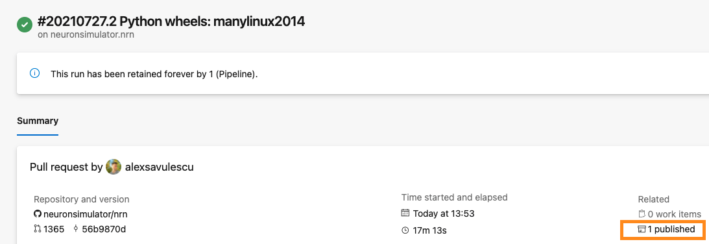
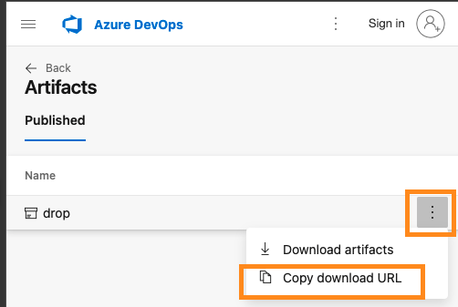

# Scheduled CI builds for NEURON
[](https://github.com/neuronsimulator/nrn-build-ci/actions/workflows/build-neuron.yml)

This repository hosts [scheduled GitHub Actions workflows](.github/workflows/neuron-ci.yaml) that verify that [the main NEURON repository](https://github.com/neuronsimulator/nrn) can be built and run on a variety of common Linux distributions and macOS versions.
At present Ubuntu 18.04, Ubuntu 20.04, Fedora 34, Fedora 35, CentOS7, CentOS8, Debian Buster (10), Debian Bullseye (11), macOS 10.15 and macOS 11.0 are tested.

The configuration of these builds serves as an up-to-date reference of how to build NEURON on each platform.

## System package installation
The system packages needed on each platform are listed in the pair of scripts:
```
scripts/install_{flavour}_{container}.sh [this file may be missing if no container-specific setup is needed]
scripts/install_{flavour}.sh
```
Taking CentOS7 (a RedHat based distribution) as an example, the scripts [install_redhat_centos:7.sh](scripts/install_redhat_centos:7.sh) and [install_redhat.sh](scripts/install_redhat.sh) install the required system packages that are not already included in the [centos:7](https://hub.docker.com/_/centos) image on Docker Hub.

Some of the content of these scripts is specific to the GitHub Actions environment in which they are regularly tested; this is commented in the following way:
```sh
# ---
# --- Begin GitHub-Actions-specific code ---
# ---
some_command_to_make_github_actions_work
# ---
# --- End GitHub-Actions-specific code ---
# ---
```
and need not be copied when these scripts are used as references for local installations.

## Runtime environment
In a similar way, modifications to the runtime environment are listed in the scripts:
```
scripts/environment_{flavour}_{container}.sh [this may be missing]
scripts/environment_{flavour}.sh             [this may be missing]
scripts/environment.sh
```
In a local installation, you might prefer to place these commands in a `~/.bashrc` or `~/.zshrc` file.

When using RedHat-derived Linux distributions, such as Fedora and CentOS, some dependencies may be made available using [Software Collections](https://www.softwarecollections.org/en/).
These are enabled using the `scl enable collection_name command`, which launches a subshell and cannot trivially be included in the `environmentXXX.sh` scripts above.
For interactive use, one can simply run
```
scl enable collection_name bash
```
to get a shell with the given collection enabled.
> When running in GitHub Actions, the `scl enable ...` command is injected in the [runUnprivileged.sh](wrappers/runUnprivileged.sh) wrapper, based on `SOFTWARE_COLLECTIONS_*` environment modules set in the [top-level YAML configuration](.github/workflows/neuron-ci.yaml). This is, for example, used to install a modern compiler toolchain on CentOS7.

## Extra dependencies and NEURON installation
The installation of extra packages (via `pip`) and the installation of NEURON itself is steered by the [buildNeuron.sh](scripts/buildNeuron.sh) script.
This closely mirrors the instructions [in the main NEURON repository](https://github.com/neuronsimulator/nrn/#build-cmake).

# Azure wheels testing - Manual workflow

Given an Azure build (PR, master, ...), it is possible to test those specific wheels on the different platforms covered by this CI.
The azure build publishes an artifact called `drop`, which contains all wheels built by the pipeline.

Here are the steps to follow: 

* Retrieve the Azure drop url

  * From the azure build page, click on `published`:
    
    
  * then from the artifact page retrieve the drop download url:
    
    

* Launch the CI manually
  1) click on `Actions` tab
  2) click on `Scheduled NEURON CI` tab under `Workflows`
  3) click on `Run workflow`
  4) input `Azure drop (artifacts) url` and click `Run workflow`
     
  


